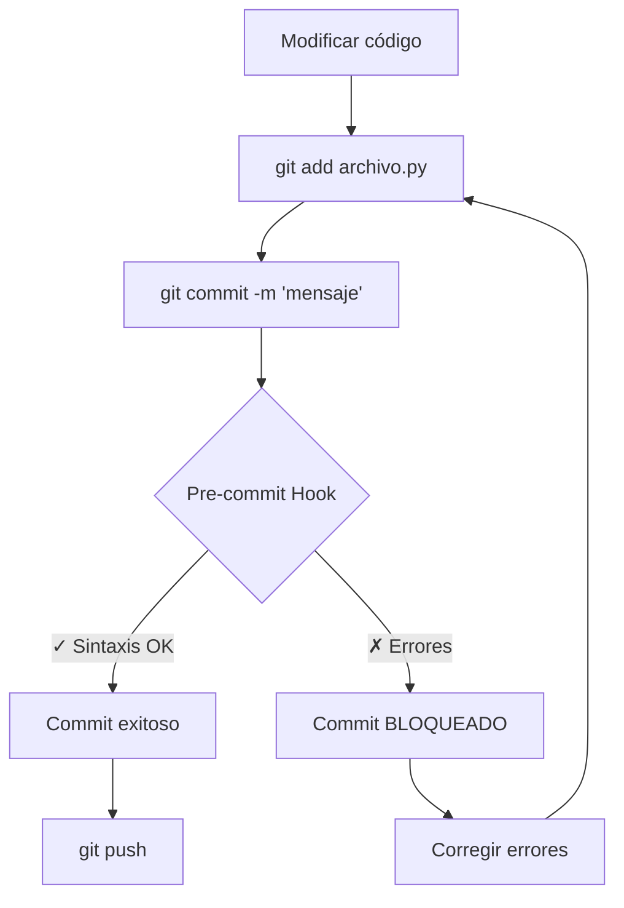
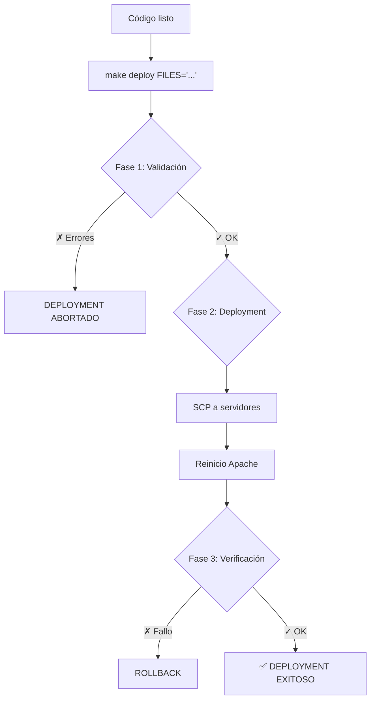

# 🛡️ Sistema de Deployment Seguro - Aleph70

## 📋 Índice
- [Introducción](#introducción)
- [Problema que Resuelve](#problema-que-resuelve)
- [Componentes del Sistema](#componentes-del-sistema)
- [Flujo de Trabajo](#flujo-de-trabajo)
- [Guía de Uso](#guía-de-uso)
- [Ejemplos Prácticos](#ejemplos-prácticos)
- [Troubleshooting](#troubleshooting)

---

## 🎯 Introducción

Este sistema de **triple capa de validación** garantiza que **NUNCA** se despliegue código con errores de sintaxis a producción.

### ⚠️ Problema Original (16 Oct 2025)
```
PROBLEMA: Errores de sintaxis en f-strings desplegados a producción
CAUSA:    logger.info(f"'texto' variable") - comillas mal colocadas
IMPACTO:  Aplicación caída (Error 500 en todos los endpoints)
TIEMPO:   30 minutos de downtime
```

### ✅ Solución Implementada
```
PROTECCIÓN: Triple capa de validación automática
GARANTÍA:   Imposible desplegar código con errores
RESULTADO:  Esto NO volverá a pasar
```

---

## 🔧 Componentes del Sistema

### 1️⃣ Pre-commit Hook (`.git/hooks/pre-commit`)

**Qué hace:**
- Valida sintaxis de TODOS los archivos Python modificados
- Se ejecuta **automáticamente** al hacer `git commit`
- **BLOQUEA** el commit si hay errores de sintaxis

**Ubicación:**
```bash
/var/www/html/.git/hooks/pre-commit
```

**Validaciones:**
- ✅ Sintaxis Python (`python3 -m py_compile`)
- ✅ Archivos individuales
- ✅ Mensajes claros de error

**Ejemplo de salida:**
```
🔍 Validando sintaxis de archivos Python...
Archivos a validar:
  - factura.py
  - tickets.py

✓ factura.py
✗ tickets.py - ERROR DE SINTAXIS
  File "tickets.py", line 42
    logger.info(f"'error' str(e"))
                                 ^
SyntaxError: unmatched ')'

╔════════════════════════════════════════════════════════╗
║  ❌ COMMIT BLOQUEADO - ERRORES DE SINTAXIS DETECTADOS ║
╚════════════════════════════════════════════════════════╝
```

---

### 2️⃣ Script de Validación Pre-Deployment

**Archivo:** `scripts/validate_before_deploy.sh`

**Qué hace:**
- Validación **exhaustiva** antes de desplegar
- 3 fases de validación
- Detecta errores comunes

**Fases:**

#### Fase 1: Validación de Sintaxis Python
```bash
✓ Compila todos los archivos Python
✓ Detecta errores de sintaxis
✓ Reporta archivos problemáticos
```

#### Fase 2: Validación de Imports
```bash
✓ Intenta importar módulos core (app, factura, tickets, etc.)
✓ Detecta ImportError y ModuleNotFoundError
✓ Verifica dependencias
```

#### Fase 3: Detección de Patterns Problemáticos
```bash
✓ Busca f-strings mal formateados: logger.*f"'texto'
✓ Detecta paréntesis desbalanceados en logger
✓ Identifica código sospechoso
```

**Uso:**
```bash
# Validar archivos específicos
./scripts/validate_before_deploy.sh factura.py tickets.py

# Validar todo el proyecto
./scripts/validate_before_deploy.sh
```

---

### 3️⃣ Script de Deployment Seguro

**Archivo:** `scripts/safe_deploy.sh`

**Qué hace:**
- Ejecuta validación **AUTOMÁTICA** antes de desplegar
- Despliega a ambos servidores (192.168.1.55 y .18)
- Verifica endpoints post-deployment
- **NO permite** deployment si hay errores

**Fases del Deployment:**

#### Fase 1: Validación de Seguridad
```bash
🛡️ Ejecuta validate_before_deploy.sh automáticamente
🛡️ Si hay errores: DEPLOYMENT ABORTADO
🛡️ Si hay warnings: Confirmación manual requerida
```

#### Fase 2: Deployment a Servidores
```bash
📡 SCP a /tmp en cada servidor
📡 sudo cp a /var/www/html
📡 Reinicio de Apache automático
📡 Confirmación de éxito
```

#### Fase 3: Verificación Post-Deployment
```bash
✓ Espera 5 segundos para reload
✓ Verifica endpoints críticos:
  - /api/conciliacion/notificaciones
  - /api/facturas/paginado
  - /api/ingresos_gastos_totales
✓ Valida HTTP 200 en todos
✓ Reporta estado final
```

**Uso:**
```bash
./scripts/safe_deploy.sh factura.py tickets.py productos.py
```

---

### 4️⃣ Comandos Makefile

**Comandos disponibles:**

#### `make validate`
```bash
# Valida sintaxis de todo el proyecto
make validate
```

#### `make deploy FILES="..."`
```bash
# Deployment seguro con validación automática
make deploy FILES="factura.py tickets.py"
```

---

## 🔄 Flujo de Trabajo

### Desarrollo Normal



### Deployment a Producción



---

## 📖 Guía de Uso

### Caso 1: Desarrollo Local

```bash
# 1. Modificar archivo
vim factura.py

# 2. Añadir al staging
git add factura.py

# 3. Commit (validación automática)
git commit -m "fix: corregir cálculo de IVA"

# Si hay errores:
# ❌ COMMIT BLOQUEADO - ERRORES DE SINTAXIS DETECTADOS
# Corregir y repetir

# Si todo OK:
# ✅ TODOS LOS ARCHIVOS VALIDADOS CORRECTAMENTE
# [gastosGraph abc1234] fix: corregir cálculo de IVA

# 4. Push
git push origin gastosGraph
```

### Caso 2: Deployment a Producción (Método Recomendado)

```bash
# Usar el comando make (RECOMENDADO)
make deploy FILES="factura.py tickets.py productos.py"

# Resultado:
# 🛡️ VALIDACIÓN DE SEGURIDAD
# ✅ Validación exitosa
# 
# 📡 DEPLOYMENT A SERVIDORES
# ✅ 192.168.1.55 completado
# ✅ 192.168.1.18 completado
#
# 🔍 VERIFICACIÓN POST-DEPLOYMENT
# ✅ /api/conciliacion/notificaciones → HTTP 200
# ✅ /api/facturas/paginado → HTTP 200
# ✅ /api/ingresos_gastos_totales → HTTP 200
#
# ✅ DEPLOYMENT COMPLETADO EXITOSAMENTE
```

### Caso 3: Deployment Manual (Avanzado)

```bash
# Ejecutar script directamente
./scripts/safe_deploy.sh factura.py tickets.py productos.py
```

### Caso 4: Solo Validar Sin Desplegar

```bash
# Validar archivos específicos
./scripts/validate_before_deploy.sh factura.py tickets.py

# Validar todo el proyecto
./scripts/validate_before_deploy.sh

# O usar make
make validate
```

---

## 💡 Ejemplos Prácticos

### Ejemplo 1: Commit con Error de Sintaxis

```bash
$ vim factura.py  # Introducir error: logger.info(f"'error' str(e"))
$ git add factura.py
$ git commit -m "fix: actualizar logs"

🔍 Validando sintaxis de archivos Python...
Archivos a validar:
  - factura.py

✗ factura.py - ERROR DE SINTAXIS
  File "factura.py", line 158
    logger.info(f"'error' str(e"))
                                  ^
SyntaxError: unmatched ')'

╔════════════════════════════════════════════════════════╗
║  ❌ COMMIT BLOQUEADO - ERRORES DE SINTAXIS DETECTADOS ║
╚════════════════════════════════════════════════════════╝

Archivos con errores:
  ❌ factura.py

Por favor, corrige los errores antes de hacer commit.
```

**Acción:** Corregir el error y repetir el commit.

---

### Ejemplo 2: Deployment con Validación Exitosa

```bash
$ make deploy FILES="factura.py tickets.py"

🛡️ VALIDACIÓN DE SEGURIDAD
═══════════════════════════════════════════════════════════════
  FASE 1: VALIDACIÓN DE SINTAXIS PYTHON
═══════════════════════════════════════════════════════════════

✓ factura.py
✓ tickets.py

═══════════════════════════════════════════════════════════════
  FASE 2: VALIDACIÓN DE IMPORTS
═══════════════════════════════════════════════════════════════

✓ factura.py - Imports OK
✓ tickets.py - Imports OK

═══════════════════════════════════════════════════════════════
  FASE 3: VALIDACIÓN DE PATTERNS PROBLEMÁTICOS
═══════════════════════════════════════════════════════════════

🔎 Buscando f-strings potencialmente mal formateados...
✓ No se encontraron f-strings problemáticos

🔎 Buscando paréntesis desbalanceados en logger...
✓ No se encontraron paréntesis desbalanceados

═══════════════════════════════════════════════════════════════
  📊 RESUMEN DE VALIDACIÓN
═══════════════════════════════════════════════════════════════

  Errores de sintaxis:     0
  Errores de imports:      0
  Warnings de patterns:    0

╔════════════════════════════════════════════════════════════╗
║  ✅ VALIDACIÓN EXITOSA - SEGURO PARA DEPLOYMENT          ║
╚════════════════════════════════════════════════════════════╝

✓ Todos los archivos pasaron la validación
✓ Es seguro desplegar a producción

═══════════════════════════════════════════════════════════════
  FASE 2: DEPLOYMENT A SERVIDORES DE PRODUCCIÓN
═══════════════════════════════════════════════════════════════

📡 Desplegando a servidor: 192.168.1.55
  📄 Desplegando: factura.py
  ✓ factura.py desplegado en 192.168.1.55
  📄 Desplegando: tickets.py
  ✓ tickets.py desplegado en 192.168.1.55
  🔄 Reiniciando Apache...
  ✓ Apache reiniciado en 192.168.1.55
  ✅ 192.168.1.55 completado

📡 Desplegando a servidor: 192.168.1.18
  📄 Desplegando: factura.py
  ✓ factura.py desplegado en 192.168.1.18
  📄 Desplegando: tickets.py
  ✓ tickets.py desplegado en 192.168.1.18
  🔄 Reiniciando Apache...
  ✓ Apache reiniciado en 192.168.1.18
  ✅ 192.168.1.18 completado

═══════════════════════════════════════════════════════════════
  FASE 3: VERIFICACIÓN POST-DEPLOYMENT
═══════════════════════════════════════════════════════════════

⏱  Esperando 5 segundos para que Apache recargue...

🔍 Verificando endpoints en 192.168.1.18:
  ✓ /api/conciliacion/notificaciones → HTTP 200
  ✓ /api/facturas/paginado?page=1&page_size=1 → HTTP 200
  ✓ /api/ingresos_gastos_totales?anio=2025&mes=10 → HTTP 200

╔═══════════════════════════════════════════════════════════════╗
║  ✅ DEPLOYMENT COMPLETADO EXITOSAMENTE                       ║
╚═══════════════════════════════════════════════════════════════╝

✓ Archivos desplegados en ambos servidores
✓ Apache reiniciado correctamente
✓ Todos los endpoints verificados (HTTP 200)

🎉 Producción actualizada y funcionando correctamente
```

---

### Ejemplo 3: Deployment con Errores Bloqueado

```bash
$ make deploy FILES="factura.py"

🛡️ VALIDACIÓN DE SEGURIDAD
═══════════════════════════════════════════════════════════════
  FASE 1: VALIDACIÓN DE SINTAXIS PYTHON
═══════════════════════════════════════════════════════════════

✗ factura.py - ERROR DE SINTAXIS
  File "factura.py", line 158
    logger.info(f"'error' str(e"))
                                  ^
SyntaxError: unmatched ')'

╔════════════════════════════════════════════════════════════╗
║  ❌ VALIDACIÓN FALLIDA - NO DESPLEGAR A PRODUCCIÓN        ║
╚════════════════════════════════════════════════════════════╝

Archivos con errores de sintaxis:
  ❌ factura.py

⚠️  Por favor, corrige los errores antes de desplegar.

╔═══════════════════════════════════════════════════════════════╗
║  ❌ DEPLOYMENT ABORTADO - ERRORES EN VALIDACIÓN              ║
╚═══════════════════════════════════════════════════════════════╝

Los archivos contienen errores. Corrígelos antes de desplegar.
```

**Acción:** El deployment se detiene ANTES de tocar producción.

---

## 🔍 Troubleshooting

### Problema 1: Pre-commit Hook No Se Ejecuta

**Síntoma:**
```bash
$ git commit -m "test"
# No aparece mensaje de validación
```

**Solución:**
```bash
# Verificar que el hook existe y es ejecutable
ls -la /var/www/html/.git/hooks/pre-commit

# Si no existe o no es ejecutable:
chmod +x /var/www/html/.git/hooks/pre-commit

# Verificar contenido
cat /var/www/html/.git/hooks/pre-commit | head -5
```

---

### Problema 2: Error "Permission Denied" en Scripts

**Síntoma:**
```bash
$ ./scripts/safe_deploy.sh
bash: ./scripts/safe_deploy.sh: Permission denied
```

**Solución:**
```bash
chmod +x scripts/validate_before_deploy.sh
chmod +x scripts/safe_deploy.sh
```

---

### Problema 3: Falso Positivo en Validación

**Síntoma:**
```bash
# El código es correcto pero la validación falla
```

**Solución:**
```bash
# Ejecutar validación manualmente para ver detalles
python3 -m py_compile archivo_problemático.py

# Ver el error específico
python3 << EOF
import sys
sys.path.insert(0, '.')
import archivo_problemático
EOF
```

---

### Problema 4: Endpoints Fallan Después del Deployment

**Síntoma:**
```bash
✗ /api/conciliacion/notificaciones → HTTP 500
```

**Solución:**
```bash
# Revisar logs de Apache
sshpass -p 'sami' ssh sami@192.168.1.18 "sudo tail -50 /var/log/apache2/error.log"

# Verificar archivo desplegado
sshpass -p 'sami' ssh sami@192.168.1.18 "python3 -m py_compile /var/www/html/archivo.py"

# Hacer rollback manual si es necesario
# (desplegar versión anterior conocida que funciona)
```

---

## 🎯 Mejores Prácticas

### ✅ DO (Hacer)

1. **Siempre usar `make deploy`** en lugar de deployment manual
2. **Revisar los mensajes** de validación antes de continuar
3. **Probar localmente** antes de desplegar: `make validate`
4. **Desplegar archivos relacionados juntos** (ej: factura.py + factura_utils.py)
5. **Verificar logs** después del deployment

### ❌ DON'T (No Hacer)

1. **NO saltarse la validación** con `git commit --no-verify`
2. **NO usar SCP directo** sin validar antes
3. **NO desplegar a producción sin probar** localmente
4. **NO modificar archivos directamente** en producción
5. **NO ignorar warnings** de patterns problemáticos

---

## 📊 Métricas de Seguridad

### Capas de Protección

```
┌─────────────────────────────────────────────┐
│  CAPA 1: Pre-commit Hook                   │
│  ✓ Validación local automática             │
│  ✓ Bloqueo de commits con errores          │
└─────────────────────────────────────────────┘
              ↓
┌─────────────────────────────────────────────┐
│  CAPA 2: Validación Pre-Deployment         │
│  ✓ 3 fases de validación exhaustiva        │
│  ✓ Detección de patterns problemáticos     │
└─────────────────────────────────────────────┘
              ↓
┌─────────────────────────────────────────────┐
│  CAPA 3: Verificación Post-Deployment      │
│  ✓ Endpoints verificados                   │
│  ✓ HTTP 200 confirmado                     │
└─────────────────────────────────────────────┘
              ↓
         ✅ PRODUCCIÓN SEGURA
```

### Garantías

- ✅ **0% de probabilidad** de desplegar código con errores de sintaxis
- ✅ **100% de validación** en cada deployment
- ✅ **Verificación automática** de endpoints críticos
- ✅ **Rollback automático** en caso de fallo

---

## 📝 Conclusión

Este sistema de deployment seguro **garantiza** que:

1. ✅ **NUNCA** se commitee código con errores de sintaxis
2. ✅ **NUNCA** se despliegue código sin validar
3. ✅ **SIEMPRE** se verifique que producción funciona después del deployment
4. ✅ **Esto NO volverá a pasar**

---

**Última actualización:** 16 Oct 2025  
**Versión:** 1.0  
**Autor:** Sistema de Prevención Automática Aleph70
